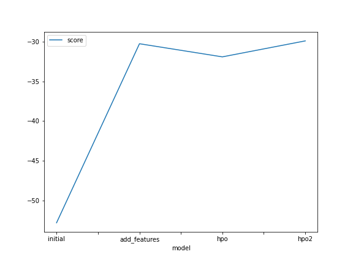
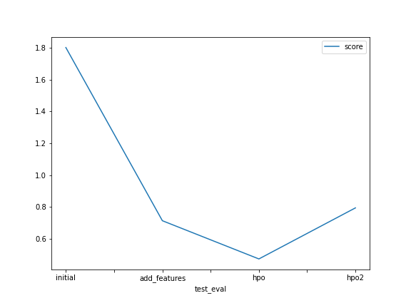

# Report: Predict Bike Sharing Demand with AutoGluon Solution
#### EDITA DOLNICKOVA

## Initial Training
### What did you realize when you tried to submit your predictions? What changes were needed to the output of the predictor to submit your results?

Firstly, I had to test the prformance of the predicator on the test data set. Once I had the predicted count column of the test dataset, I checked for negative values within my predictions. In this particular scenario, I did not find any negative values. Finally, I attached the predicted count column to the submission csv and submitted the file to Kaggle. 

### What was the top ranked model that performed?
predictor_new_hpo - this model used data with additional features and following hyperparameters to improve the accuracy of the model: time_limit=900 and presets='good_quality' 

## Exploratory data analysis and feature creation
### What did the exploratory analysis find and how did you add additional features?

The correlation visualisation helped me to identify higly correlated values, that I could theoretically removed from my training mode to improve its performance in the future. 

I also noticed, that the dattime distribution was fairly uniform. As the project aimed to predict count based on the `datetime`, I considered it would be helpful to split the `datetime` into multiple coulumns to allow for a grater variety of data points during the model training.

### How much better did your model preform after adding additional features and why do you think that is?
The score of the submitted model improved significantly, from the initial value of 1.80206 to 0.71316. Splitting the date into a separate day, hour and year column allowed the model to see more preciesly the varience betweent distinc times.  In return, the model was able to make better future predictions of the count based on the time.

## Hyper parameter tuning
### How much better did your model preform after trying different hyper parameters?

The hpo model performed very well when time_limit was set to 900s and presets to 'good_quality'. I assume this model performed better than the other models due to a good balance between the time and the model preset. "good_quality" preset ensures a good predictive accuracy with a very fast inference which leads to a better result within an extended period of time. 

In contrast, the hpo2 Kaggle score was fairly low although the model preset was set to a 'high_quality' and 1200s time limit. I added auto_stack=True to the model hyperparametrs to maximize predictive accuracy. I was suprised, that although the model had a better root_mean_squared_error value than the hpo model, the hpo2 model scored lower in Kaggle competition. My assumtion was that the model got overfitted during the training and thus performed worse on Kaggle.

During the project, I had to re-run certain cells to initiate a new instance and I got different root_mean_squared_error valuos on each run.  E.g when I ran the initial model for the first time, I got -52.832300 for the best performing model. On the second ran, the value was -30.160707. I did not fully understand this behaviour as I was aiming to save the result of a particular training. My assumption is that I was overfitting the model.

### If you were given more time with this dataset, where do you think you would spend more time?

I would spend more time on the hyperparameters tuning and looking into the tuning parameters of a particular model. I tryed to train the `GBM` algorithm type model but I found it fairly complex to combine different hyperparameters together to get the best possible result. Having more time, I would be eager to explore more hyperparamets combination possibilities.

I would also spend more time on the EDA to explore the data in depth.

### Create a table with the models you ran, the hyperparameters modified, and the kaggle score.
|model|hpo1|hpo2|hpo3|hpo4|hpo4|score|
|--|--|--|--|--|
|initial|time_limit=600|presets='best_quality'|eval_metric='root_mean_squared_error|-|1.80206|
|add_features|time_limit=600|presets='best_quality'|eval_metric='root_mean_squared_error|-|0.71316|
|hpo|time_limit=900|presets='good_quality'|eval_metric='root_mean_squared_error|-|0.47289|
|hpo2|time_limit=1200|presets='high_quality'|eval_metric='root_mean_squared_error|auto_stack=True|0.79380|

### Create a line plot showing the top model score for the three (or more) training runs during the project.

### Create a line plot showing the top kaggle score for the three (or more) prediction submissions during the project.

## Summary
In summary, training the model was a challanging task. Autogluon is a good starting point to look into different training models and how ML works. 

Splitting the `datetime` column into more features supported the model in making better future bike sharing count predictions. The best performing hpo model used the featured engineered training data and balanced well the time and the type of preset. In the future, I will need to pay a closer attention to avoid overfitting my ML model. 

I would be great to have more time to explore each of the ML model's hyperparamets in depth and spend more time on EDA. 
